# Git 사용법

## 1.  Git이란?

Git은 **분산버전관리 시스템**(Version Control System, VCS)이다.중앙집중식(Central Control System)보다 속도가 빠르고 효율적으로 개발할 수 있다. Git은 여러개의 branch로 쪼개지고 merge로 병합하면서 하나의 프로젝트를 완성시킨다.

## 2. Git 설치

Git을 사용해 소스를 관리하기 위해서는 아래의 두가지 방법이 있다.

- SourceTree라는 Git GUI 툴을 이용한 Git
- Git Bash를 이용한 Git

나는 두번째 방법을 사용할 꺼다. :)

## 3. Git Bash 설치 및 사용법

### 3.1 설치

우선, [https://git-scm.com/](https://git-scm.com/) 사이트로 들어간다.

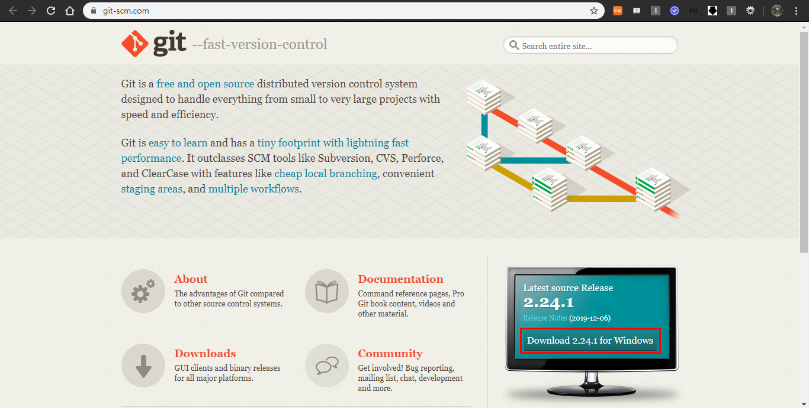

Window인 경우, 위의 그림에 표시된 Download 2.24.1 for Windows를 클릭해준다.

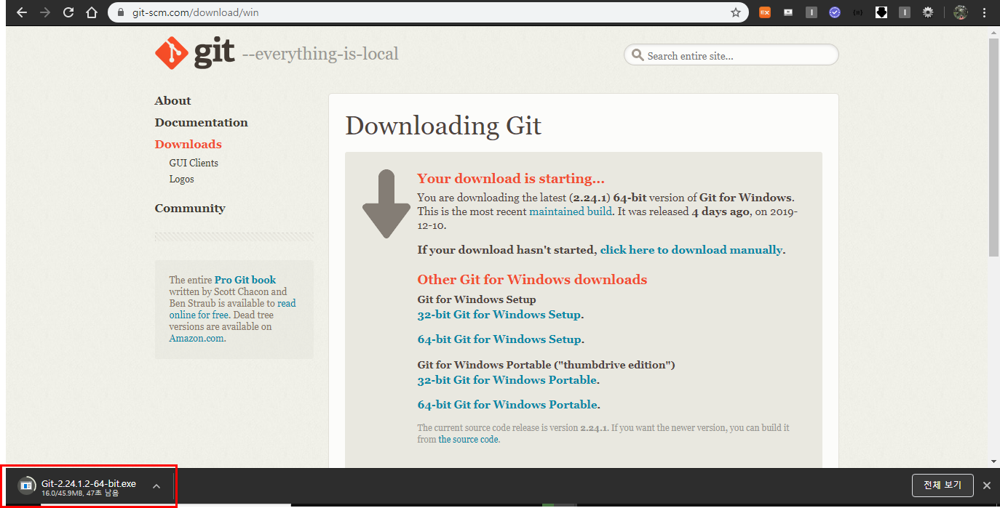

위의 그림과 같은 페이지가 뜨며 잠시 기다리게 되면, 설치파일이 다운로드되기 시작한다.

다운로드된 설치파일을 누르게 되면 아래와 같은 창이 뜨게 된다.

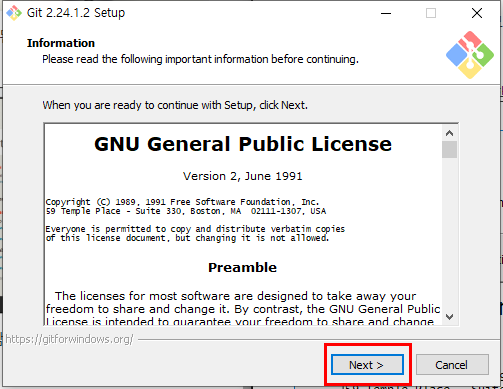

Next 버튼을 클릭한다.

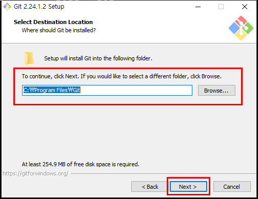

Git을 어디에 설치할지 정하는 부분인데 기본으로 설정해준다.

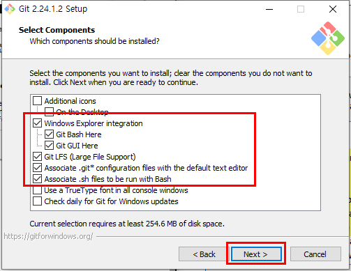

기본으로 컴포넌트들이 체크되어있는데 별다른 선택없이 Next 버튼을 클릭한다. 

Windoew Explorer integration은 Git Bash 뿐만 아니라 Windows Command도 사용하기 위해서 체크 되어있는것이다.

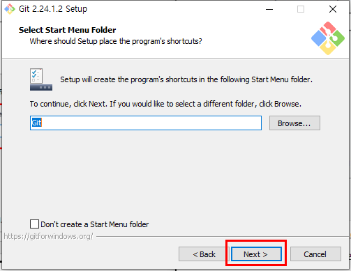

시작 메뉴에 폴더를 만드는 부분이다. 시작메뉴에 폴더를 추가하고 싶지 않다면 Don't create a Start Menu folder 체크박스를 클릭하고 Next 버튼을 누른다.

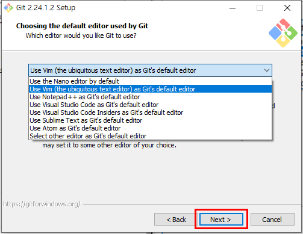

깃에서 사용할 에디터를 선택하는 부분으로 default editor인 Vim이 기본적으로 선택되어 있다. 이 부분도 사용자의 취향에 따라 선택하고 나는 default editor인 Vim을 사용할 것이다.

**Vim**

- 편집모드 : `i` - 문서편집가능
- 명령모드 : `esc`
  - `dd` : 해당 줄 삭제
  - `:wq` : 저장 및 종료
    - `w` : 저장(write)
    - `q` : 종료(quit)
  - `:qi` : 강제종료
    - `q` : quit
    - `!` : 강제

Next 버튼을 클릭한다.

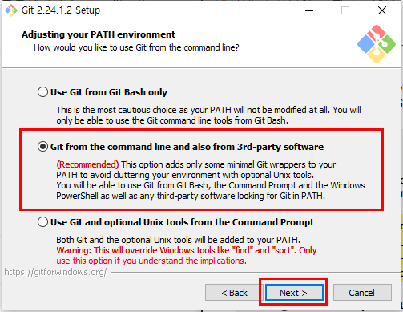

이 부분도 기본적으로 두번째가 체크 되어있다. 이 부분은 Git을 사용하기 위한 환경을 설정하는 단계이다. 체크된 두번째는 Git을 Git Bash 뿐만 아니라 Windows Command Prompt 에서도 사용할 수 있도록 해주는 환경설정이다. 

선택되지 않은 처음 선택지는 Git Bash 에서만 Git 을 사용할 수 있도록 하는 것이고 마지막 선택지는 Windows Prompt에서 몇가지 유닉스 도구와 Git을 사용할 수 있도록 하는 것이다. 마지막의 경우 윈도우와 유닉스 명령어의 충돌이 발생할 수 있다.

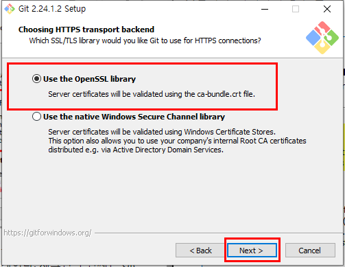

기본값으로  OpenSSL Library 사용을 선택한다.

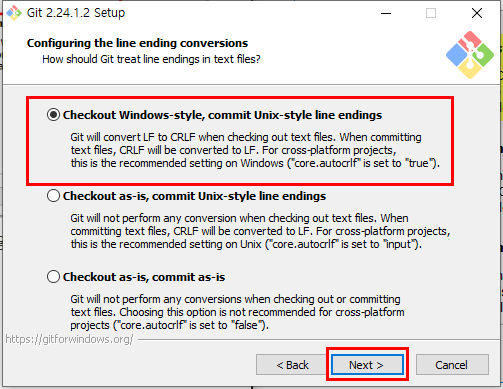

행변환에 대한 스타일을 선택하는 단계이다. 읽어보고 원하는대로 선택하면 된다. 기본값으로 설정해도 무관하다!!

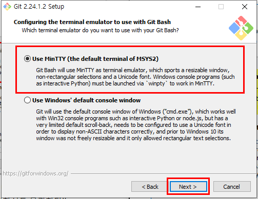

어떤 터미널 에뮬레이터를 사용할 것인지를 선택하는 단계이다. 기본으로 선택되어있는 MinTTY 를 선택해준다. 이 또한 기본값으로 진행하거나 원하는대로 진행해도 무관하다.

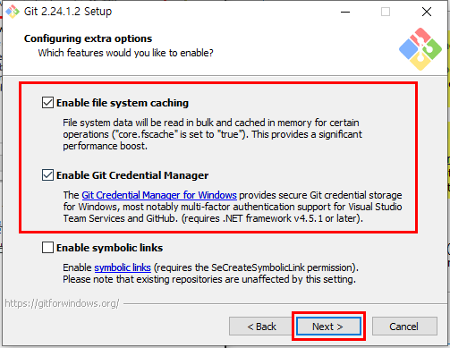

이부분은 추가 옵션에 관한 부분으로 시스템 캐시 파일 생성과 매니저 제공, 심볼릭 링크 생성에 대해 원하시는 대로 체크하면된다. 나는 앞서 이전에 다른 옵션선택들과 마찬가지로 기본으로 선택되어있는대로 사용할 것이다.

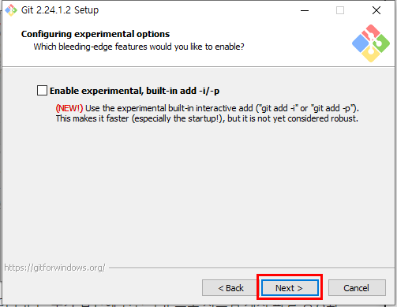

이 부분은 새로 추가된 옵션으로 아무것도 선택을 안하고 이 단계는 넘어갈꺼다.

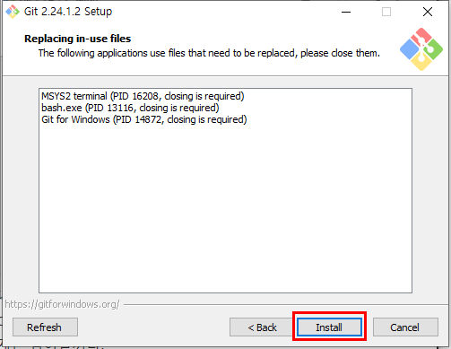

마지막 단계까지 마치면 설치를 진행한다. (나의 경우 이미 gitbash가 설치되어 있어 위와 같은 창이 뜨는 것 같다..!)

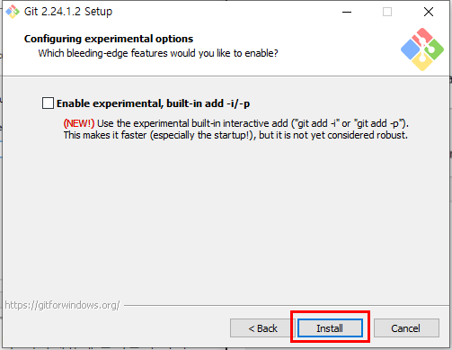

기본적으로는 이전의 이미지는 이미 설치되어있을 경우의 상태이고 처음 설치하게 되면 이러한 창이 뜨게 되어 install을 클릭하면 된다.

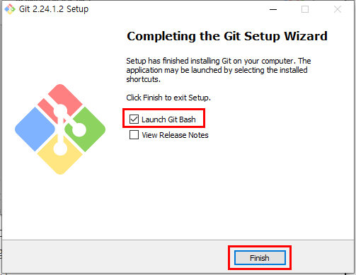

설치 완료창이 뜨게 되면 기본으로 체크되어있는 릴리즈 노트보기를 해제하고 깃배시를 실행시킨다.

### 3.2 Git Bash를 이용한 버전 체크

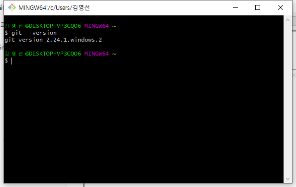

깃 배시를 실행한 창의 모습이다.

**버전 체크**

```bash
$ git --version
git version 2.24.1.windows.2
```

깃 배시 이외에 함께 설치된 Git CMD도 실행하면 버전확인이 가능하다. CMD 보다는 Git Bash를 자주 이용.

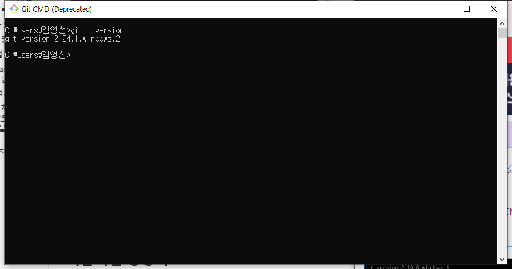

### 3.3  기본설정

#### config

깃을 **처음 설치**했다면 깃/깃허브 `author` 설정을 해줘야한다.

만약, [https://github.com/](https://github.com/)에 가입이 안되어있다면 가입한다.

```bash
# git commit에 사용될 username
$ git config --global user.name {github_name}
# git commit에 사용될 email
$ git config --global user.email {githib_email} 
```

설정한 내용을 확인하기 위해 아래의 명령어를 입력한다.

```bash
# 설정한 내용을 확인할 수 있다.
$ git config --list 

$ git config --global -l
user.email = # my email
user.name = # my name
```

#### .gitignore

프로젝트를 진행할 때, `git`으로 관리하지 않을 파일들 또는 폴더들을 제외시키는 설정을 할 수 있다.

프로젝트를 시작할 때 어떠한 내용을 넣어야할지 모르겠다면 아래의 주소로 들어가서 검색해보면 된다!!

[https://www.gitignore.io/](https://www.gitignore.io/)

#### + 로컬저장소에서 활용

##### 1. git 저장소 설정하기

특정 폴더에서 `git`을 사용하기 위해서는 아래와 같은 명령어를 입력한다.

```bash
$ git init
Initialized empty Git repository in C:/Users/김영선/Desktop/Git/.git/
```

- 해당 폴더 안에 `.git`이라는 숨김폴더가 생성이 되며,  모든 `git`과 관련된 동작은 해당 폴더에 기록된다.
- git bash 에서 `(master)`라는 branch 정보가 표시된다.

##### 2. add : 커밋할 파일 선정

`git`에서 `commit`할 대상 파일을 `staging area`로 이동시키는 명령어이다.

★ 항상 `git status` 명령어를 통해서 현재 상태를 확인하는 것이 가장 중요!!!! ★

```bash
# 모든 파일들을 추가할 때
$ git add .
# 특정 파일을 추가할 때
$ git add {특정파일명}
```

##### 3. commit 

`git`에서 이력을 남기기 위해서는 `commit`을 통해서 진행한다.

`commit`을 입력할 때에는 항상 `-m`을 사용하여 커밋 메시지를 작성해야한다.

```bash
$ git commit -m "커밋할끄야아아"
```


#### + 원격저장소(remote repository)에서 활용

원격저장소를 제공해주는 서비스는 `github`외에도 많이있다. 

나는 `github`를 이용해 볼꺼다. :)

##### 1. 기본설정하기

`github`에 `Repositories` 안에서 비어있는 새로운 저장소( `repository`)를 생성한다.

##### 2. 원격저장소 설정하기 - remote

로컬저장소와 원격저장소를 연결해준다.

```bash
$ git remote add origin https://~{깃에 만든 저장소의 주소}
# 저장된 원격저장소 목록 확인하기
$ git remote -v
# 삭제하기
$ git remote rm origin
$ git remote -v # 삭제된거 확인
```

##### 3. push

원격저장소에 업로드를 하기 위해서는 `push`명령어가 필요하다.

변경된 사항(`commit`)이 있으면 아래의 명령어를 통해 매번 업로드를 하면된다.

```bash
$ git push -u origin master
$ git push origin master
```


## 4. 기본적인 용어

**커맨트 라인(Command Line):** 깃 명령어를 입력할 때 사용하는 컴퓨터 프로그램. 맥에선 터미널이라고 한다. PC에선 기본적인 프로그램이 아니어서 처음엔 깃을 다운로드해야 한다. 두 경우 모두 마우스를 사용하는 것이 아닌 프롬프트로 알려진 텍스트 기반 명령어를 입력한다.

**저장소(Repository):** 프로젝트가 거주(live)할 수 있는 디렉토리나 저장 공간. 깃허브 사용자는 종종 `repo`로 줄여서 사용한다. 당신의 컴퓨터 안의 로컬 폴더가 될 수도 있고, 깃허브나 다른 온라인 호스트의 저장 공간이 될 수도 있다. 저장소 안에 코드 파일, 텍스트 파일, 이미지 파일을 저장하고, 이름붙일 수 있다.

**버전관리(Version Control):** 기본적으로, 깃이 서비스되도록 고안된 목적. MS 워드 작업할 때, 저장하면 이전 파일 위에 겹쳐쓰거나 여러 버전으로 나누어 저장한다. 깃을 사용하면 그럴 필요가 없다. 프로젝트 히스토리의 모든 시점의 `스냅샷`을 유지하므로, 결코 잃어버리거나 겹쳐쓰지 않을 수 있다.

**커밋(Commit):** 깃에게 파워를 주는 명령이다. 커밋하면, 그 시점의 당신의 저장소의 `스냅샷`을 찍어, 프로젝트를 이전의 어떠한 상태로든 재평가하거나 복원할 수 있는 체크포인트를 가질 수 있다.

**브랜치(Branch):** 여러 명이 하나의 프로젝트에서 깃 없이 작업하는 것이 얼마나 혼란스러울 것인가? 일반적으로, 작업자들은 메인 프로젝트의 브랜치를 따와서(branch off), 자신이 변경하고 싶은 자신만의 버전을 만든다. 작업을 끝낸 후, 프로젝트의 메인 디렉토리인 `master`에 브랜치를 다시 `Merge`한다.

## 5. 주요 명령어 

[https://git-scm.com/book/ko/v2](https://git-scm.com/book/ko/v2)

깃 명령어는 아주 많다. 하지만 깃의 기본을 사용할 때에는 몇 개의 명령어만 알면된다. 모두 `git`이란 단어로 시작된다.

### + 기본적인 명령어

- 화면 초기화 : `Ctrl + L`
- 한 행의 처음과 끝 : `Ctrl + A`, `Ctrl + E`
- 목록 보기 : `ls` 또는 `dir`
- 파일의 내용 보기 : `cat`
- 특정 문자를 검색 : `grep`
- 디렉터리로 이동 : `cd`
- 디렉터리 생성 : `mkdir`
- 파일 삭제 : `rm`
- 파일 생성 : `touch`

### 5.1 git config ( 최초 1회 실행 )

깃을 **처음 설치**했다면 깃/깃허브 `author` 설정을 해줘야한다.

먼저 [https://github.com/](https://github.com/)에 가입이 안되어있다면 가입한다.

```bash
# git commit에 사용될 username
$ git config --global user.name {github_name}
# git commit에 사용될 email
$ git config --global user.email {githib_email} 
```

설정한 내용을 확인하기 위해 아래의 명령어를 입력해본다.

```bash
# 설정한 내용을 확인할 수 있다.
$ git config --list 

$ git config --global -l
user.email = # my email
user.name = # my name
```

 ### 5.2 git init

현재 디렉토리 안에서 이 명령을 실행하기 전까지는 그냥 일반 폴더이다. 이것을 입력한 후에 추가적인 깃 명령어들을 사용 할 수 있다. **현재 디렉토리를 로컬저장소로 설정**한다.
```bash
$ git init
Initialized empty Git repository in C:/Users/김영선/Desktop/Git/.git/
```

 ### 5.3 git status

**로컬저장소 현재 상태를 체크**한다. 어떤 파일이 원격저장소 안에 있는지, 커밋이 필요한 변경사항이 있는지, 현재 원격저장소의 어떤 브랜치에서 작업하고 있는지 등을 볼 수 있다.

 ### 5.4 git add 

깃에서 commit할 대상 파일을 `staging area`로 이동시키는 명령어이다.
```bash
# 모든 파일들을 추가할 때
$ git add .
# 특정 파일을 추가할 때
$ git add {특정파일명}
```

 ### 5.5 git commit

깃의 **가장 중요한 명령어**이다. add 한 파일들을 로컬저장소에 저장한다. 보통 `git commit -m "커밋 메세지"` 형식으로 사용한다. `-m`은 명령어의 그 다음 부분을 메시지로 읽어야 한다는 것을 의미한다.

```bash
$ git commit -m "커밋할끄야아아"
```

### 5.6 git log

로컬저장소의 커밋 이력을 조회한다.

### 5.7 git push 

로컬 컴퓨터에서 작업하고 나의 커밋을 깃허브에서 온라인으로도 볼 수 있기를 원한다면 이 명령어로 깃허브에 변경사항을 `push`하여 원격저장소에 **저장**한다.

```bash
$ git push -u origin master
$ git push origin master
```

### 5.8 git pull

로컬 컴퓨터에서 작업할 때 작업하고 있는 저장소의 최신 버전을 원하면 이 명령어(`pull`)로 깃허브로부터 변경사항을 다운로드한다.

```bash
$ git pull origin master
```

### 5.9 git remote

로컬저장소와 원격저장소(github)를 연결한다.

```bash
$ git remote add origin https://~
```

### 5.10 git help

명령어를 잊어버렸을때 커맨드 라인에 `git help`를 입력하면 가장 많이 사용되는 깃 명령어들을 보여준다. 좀 더 자세하게 알고싶으면 특정 깃 명령어를 입력해서 설정하는 법을 알 수 있다.

```bash
$ git help
$ git help remote
```

### 5.11 git merge 

브랜치에서 작업을 끝내고, 모든 협업자가 볼 수 있는 master 브랜치로 **병합**할 수 있다. `git merge sunny`는 `"sunny"` 브랜치에서 만든 모든 변경사항을 master로 추가한다.

### 5.12 git diff 

워킹 디렉터리와 다른 커밋을 비교한다.

 ### 5.13 git branch 

이 명령어는 새로운 브랜치를 만들고, 자신만의 변경사항과 파일 추가 등의 커밋 타임라인을 만든다. 나의 제목이 명령어 다음에 온다. 새 브랜치를 `"sunny"`로 부르고 싶으면, `git branch sunny`를 타이핑한다.

```bash
# branch 목록 확인
$ git branch
# {브랜치이름} 생성
$ git branch {브랜치이름}
# {브랜치이름} 삭제
$ git barnch -d {브랜치이름}
```

 ### 5.7 git checkout

워킹 디렉터리의 소스를 특정 커밋 또는 특정 브랜치로 변경한다. master 브랜치를 들여다 보고 싶으면, `git checkout master`를 사용할 수 있고, `git checkout sunny`로 또 다른 브랜치를 들여다 볼 수 있다.

```bash
# {브랜치이름}으로 이동
$ git checkout {브랜치이름}
# {브랜치이름} 생성 및 이동
$ git checkout -b {브랜치이름}
```


